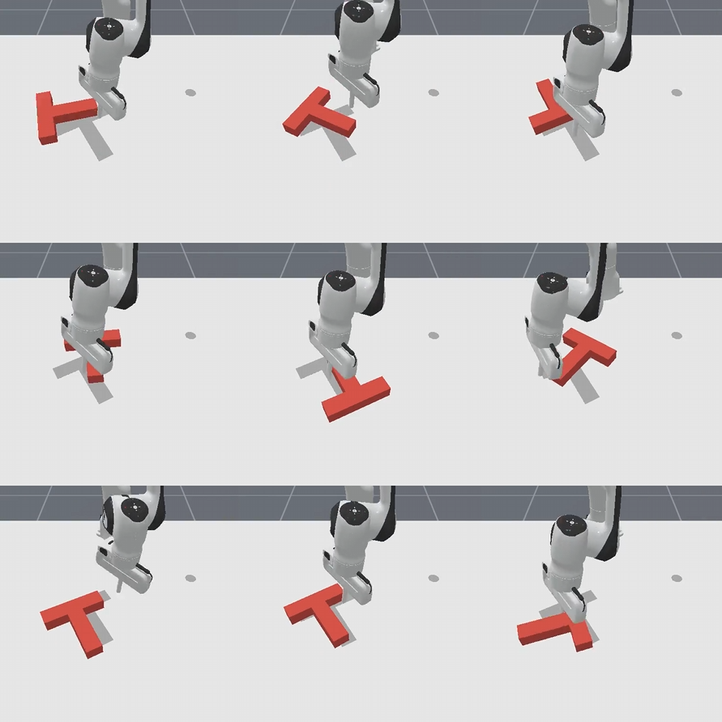
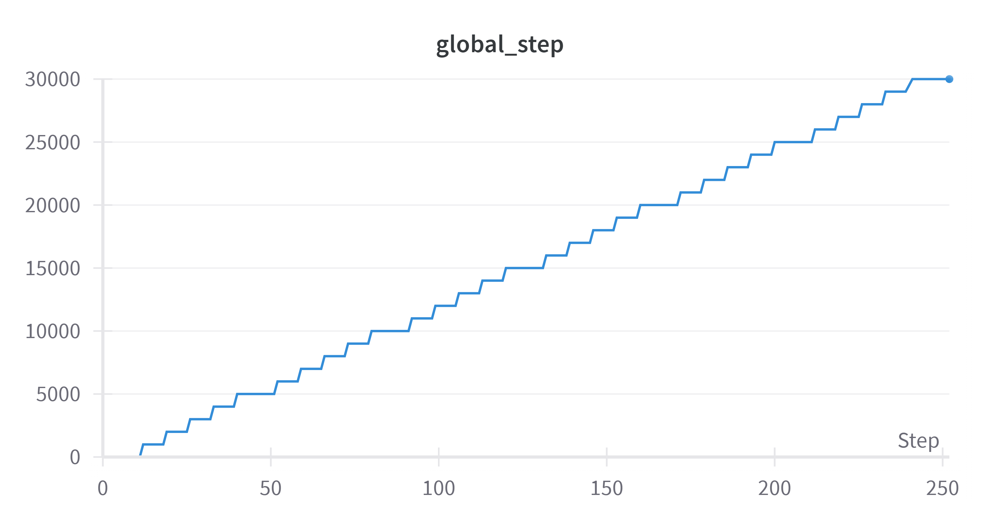
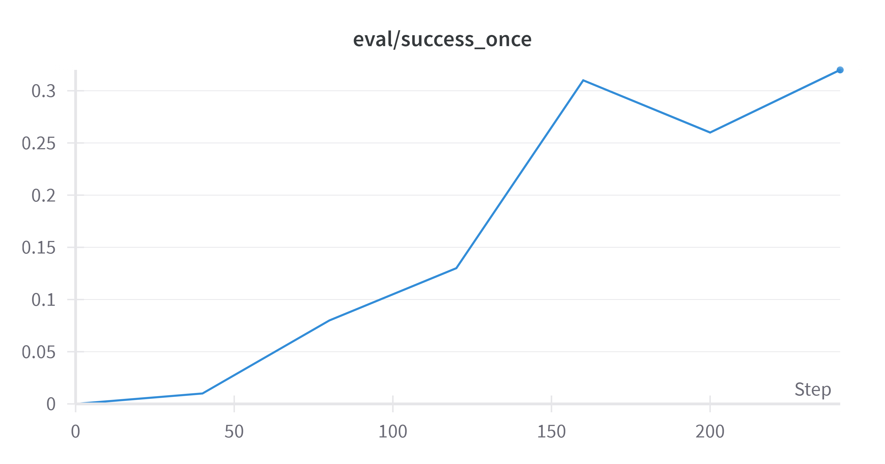
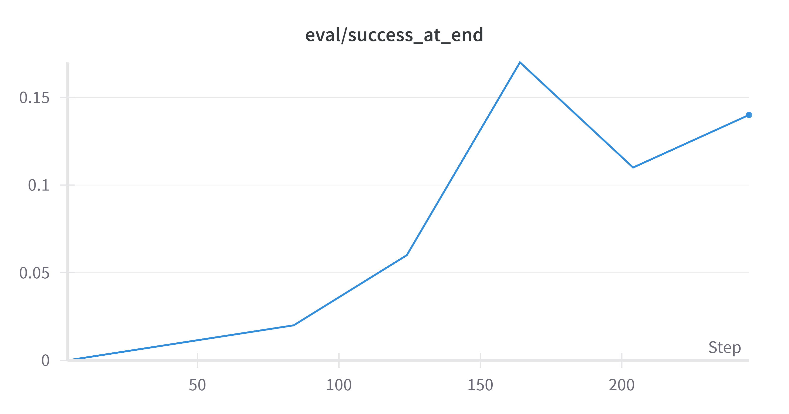
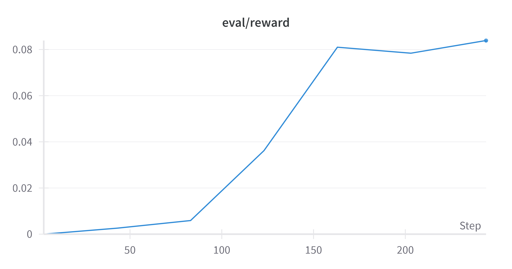
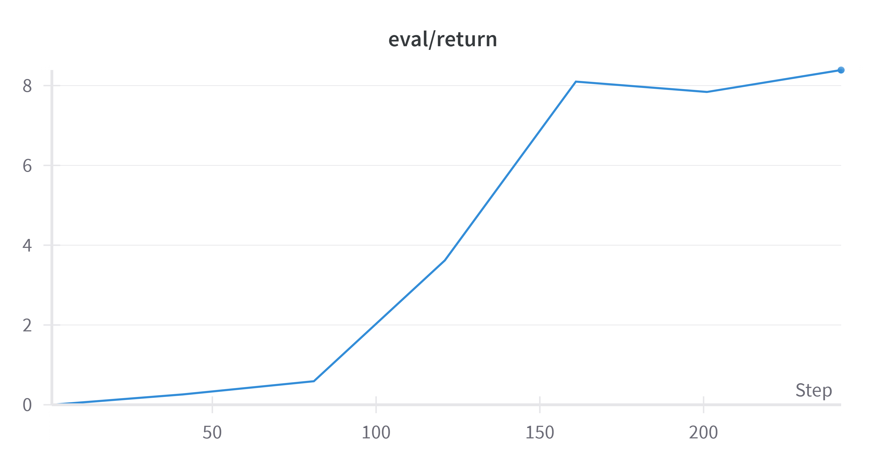
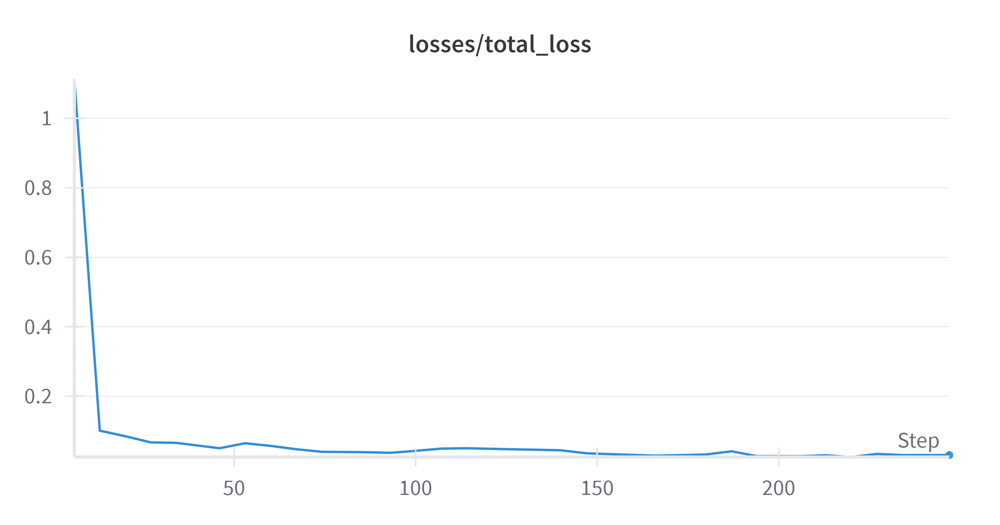
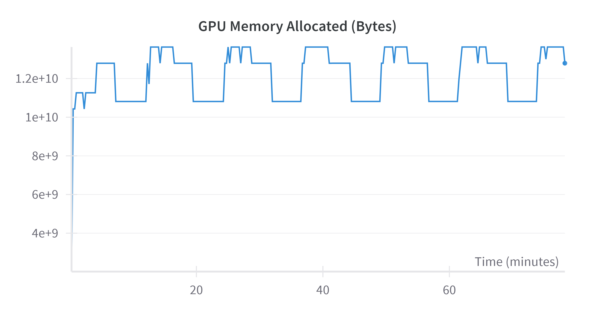
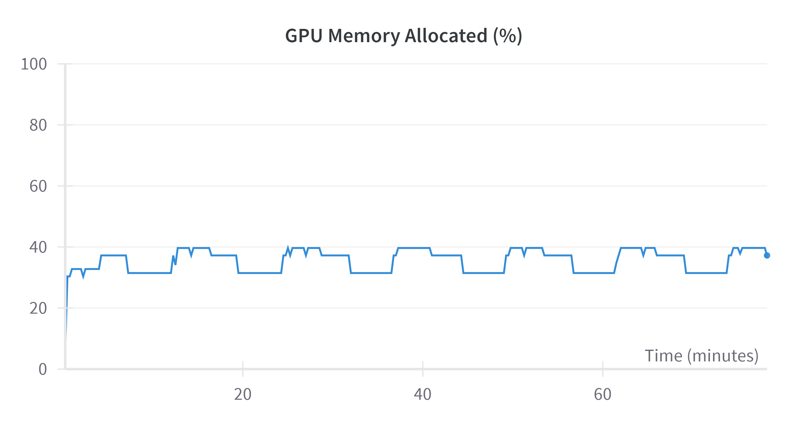
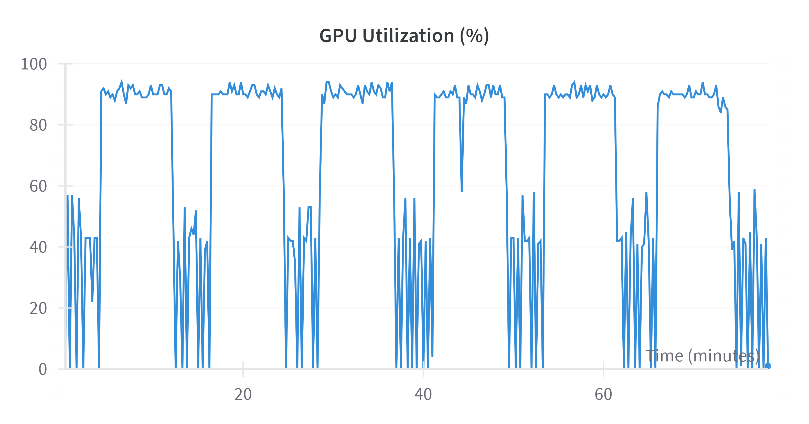

# RIPL Lab Assignment Submission by Mainak Mallick 
---

## Task I: ManiSkill Setup

**Environment Setup:**
- Successfully set up the ManiSkill environment by following the [official ManiSkill installation guide](https://github.com/haosulab/ManiSkill).
- Used Conda for environment isolation and created the environment as mentioned [here](https://github.com/haosulab/ManiSkill/tree/main/examples/baselines/diffusion_policy).
- Installed all required Maniskill dependencies using:
```bash
# install the package
pip install --upgrade mani_skill
# install a version of torch that is compatible with your system
pip install torch
```
- Verified the setup by running:
  - `python -m mani_skill.examples.demo_play` for rendering demo episodes
  - `python -m mani_skill.examples.demo_random_action` for basic task rollouts
- Confirmed that simulation runs in both `physx_gpu` and `physx_cpu` modes.

**Colab Notebook:**
- Implemented each section from the official ManiSkill colab notebook for hands-on familiarity.
- Visualized rollouts and manipulated environment parameters.
- Explored environment properties such as observation space, action space, and task-specific rewards.

**Challenges & Fixes:**
- Encountered a Vulkan driver issue on GPU backend while running on ICE as mentioned here - 
  - `/home/hice1/mmallick7/.local/lib/python3.10/site-packages/sapien/_vulkan_tricks.py:37: UserWarning: Failed to find Vulkan ICD file. This is probably due to an incorrect or partial installation of the NVIDIA driver. SAPIEN will attempt to provide an ICD file anyway but it may not work. warn`. This was unresolved, because I didn't had the permission for running sudo apt-get install libvulkan1 command - though it didn't impact the training process because it's only used for rendering interactive UI.

---

## Task II: Training Diffusion Policy on Push-T

**Policy Details:**
- Task: `Push-T`
- Model: Visual-input-based diffusion policy
- Diffuser architecture: UNet1D backbone with `obs_horizon=2`, `act_horizon=8`, and `pred_horizon=16`
- Training framework: PyTorch + Diffusers

**Training Config:**
- Total iterations: 30,000 (could have gone with 1000,000 iterations but got stuck due to time constrait)
- Batch size: 256
- Learning rate: 1e-4 (AdamW)
- max_episode_steps 100
- Demos - 451
- VRAM Usage: ~12.1GB (NVIDIA L40S)
- Warmup steps - 500
- demos - 451

**Dataset Generation:**
For this, first run command - ` python -m mani_skill.utils.download_demo "PickCube-v1" ` to download  `trajectory.none.pd_joint_delta_pos.physx_cuda.h5 ` with no observation mode selected.  
Then I ran the command - 
```bash
python -m mani_skill.trajectory.replay_trajectory \
  --traj-path ~/.maniskill/demos/PushT-v1/rl/trajectory.none.pd_ee_delta_pose.physx_cuda.h5 \
  --use-first-env-state -c pd_ee_delta_pos -o rgb \
  --save-traj --num-envs 256 -b physx_cuda
```
which was running with `reward="dense"` config which takes the no obs file with initial state and actions, replays it by setting the initial state and then stepping through the recorded actions using the pd_ee_delta_pos controller, generates rgb image observations (requires rendering) during the replay, and saves a new `trajectory file trajectory.rgb.pd_ee_delta_pos.physx_cuda.h5` containing actions and the corresponding `rgb` observations file.
**Training Procedure:** 
For training I used this command - 
```
seed=1
demos=451
 
python /home/hice1/mmallick7/scratch/maniskill/ManiSkill/examples/baselines/diffusion_policy/train_rgbd.py \
  --env-id PushT-v1 \
  --demo-path ~/.maniskill/demos/PushT-v1/rl/trajectory.rgb.pd_ee_delta_pos.physx_cuda.h5 \
  --control-mode pd_ee_delta_pos \
  --sim-backend physx_cuda \
  --num-demos "$demos" \
  --max_episode_steps 100 \
  --total_iters 30000 \
  --obs-mode rgb \
  --exp-name diffusion_policy-PushT-v1-rgb-${demos}_motionplanning_demos-${seed} \
  --track
```
**Outcomes:**
- Experimented with prediction horizon and acting horizon combinations-
- Act_horizon, pred_horizon(1): 8,16  
  Act_horizon, pred_horizon(2): 6,12  
  Act_horizon, pred_horizon(3): 10, 18
- Highest success rate on Push-T: 30.4% on 8,16 combination
- Observed near to no performance improvement dufference when the action horizon is modified, but for prediction horizon I abserved maximum succes rate in 8,16 combination and dipped in both ways.
- Trained models saved in `/ManiSkill/scripts/data_generation/runs/diffusion_policy-PushT-v1-rgb-451_motionplanning_demos-1/checkpoints/best_eval_success_at_end.pt`

**Challenges and Comments:**
- Stabilization required tuning batch size and warmup steps.
- As per the issue provided [here](https://github.com/haosulab/ManiSkill/issues/882) there should be 700 demonstartions but I could found only 451 in total.
- Faced challenging situation while creating the trajectory.rgb.pd_ee_delta_pos.physx_cuda.h5 file from the trajectory.none.pd_joint_delta_pos.physx_cuda.h5 file, dense reward was initially not getting genrated,  there was a just a success failure boolean, as a result so there was no improvement while training. Fixed it by explicitly passing reward mode as dense while generating the data.

**Results and Plots:**
Below are snapshots of training metrics visualized using Weights & Biases:

| Chart 1 | Chart 2 | Chart 3 |
|---------|---------|---------|
|  |  |  |
| Chart 4 | Chart 5 | Chart 6 |
|  |  |  |
| Chart 7 | Chart 8        |   Chart 9      |
|  |  |  |


The rest of the plots can be found [here](https://wandb.ai/mainakmallick-georgia-institute-of-technology/ManiSkill/runs/soja5l5v?nw=nwusermainakmallick)
---

## Task III: Multi-Modal Behavior Analysis

**Method:**
- Performed rollout visualizations of the trained diffusion policy on Push-T
- Captured videos across 70 evaluation episodes with `rgb_array` rendering enabled, each with 10 parallel env rollout simulation

**Findings:**
- Observed two distinct behavior modes:
  1. Push from Top part
  2. Push from Bottom part
  which leads to a success in demo 1 but failure in demo 2.
- Videos named: [Demo Video 1](videos/demo1.mp4), [Demo Video 2](videos/demo2.mp4)

**Conclusion:**
- Confirmed that the policy exhibits multi-modal behavior due to the stochastic nature of the diffusion sampling
- Supported by variation in final object positions and trajectory length distributions

---

## Task IV: Implementing Steering Techniques
## Literature Review: Steering in Diffusion Model Architectures

Recent advancements in steering diffusion-based generative policies have introduced efficient mechanisms for aligning robot behavior with user intent during inference, without requiring fine-tuning. **Inference-Time Policy Steering (ITPS)** [Wang et al., 2024] proposes guiding a frozen generative policy using real-time human interactions (point goals, trajectory sketches, and physical corrections). It incorporates these forms of input as alignment objectives during the sampling process, either post-hoc (e.g., output perturbation, ranking) or during diffusion (e.g., guided or stochastic sampling). Among these, **Stochastic Sampling (SS)** demonstrated the best trade-off between alignment and constraint satisfaction by approximating sampling from the product of the trajectory and user-intent distributions, instead of their sum, thereby reducing distribution shift and preserving the validity of the generated trajectories. 

In parallel, **Value-Guided Policy Steering (V-GPS)** [Nakamoto et al., 2024] uses a value function trained via offline RL to re-rank actions sampled from generalist policies (e.g., Octo, RT-X, OpenVLA) at test-time. This modular plug-and-play framework improves robustness and precision in real-world robotic manipulation tasks without altering the base policy. Unlike ITPS, which leverages interaction-conditioned objectives for fine-grained trajectory shaping, V-GPS focuses on maximizing task reward alignment through high-value action selection, and has shown consistent improvements across 12 real-world and simulated tasks. 

Together, these works underscore a growing trend in **compute-aware inference-time steering** that enables adaptive, goal-aligned behaviors in pre-trained diffusion or transformer-based policies, and highlight promising directions for scalable, multimodal control in robotics.


**Evaluation script generation:**

After quite a few number of attempts, I couldn't able to find out a standalone evaluation script or configuration of train_rgbd.py for the diffusion policy case(though there are configurations in ppo case) which will just run the trained diffusion policy 250 times in this “hard” evaluation episode and report the success rate (SR) in this specific evaluation episode over 5 different random seeds. So I developed one - `test_policy.py`

While developing this script I encountered a couple of challenges - 

*   *Challenge:* Code failed with `ModuleNotFoundError` for `FrameStack`.
    *   *Implication:* Script failed to start due to inability to import a necessary environment wrapper.
    *   *Solution:* Correct the import path for `FrameStack` from `...wrappers.observation` to `...wrappers`.

*   *Challenge:* Checkpoint loading failed with `size mismatch` errors for model layers.
    *   *Implication:* Pre-trained agent weights could not be loaded because the current model structure didn't match the saved one.
    *   *Solution:* Ensure evaluation script arguments (`--obs_mode`, `--control_mode`) match the agent's configuration during checkpoint training.

*   *Challenge:* `evaluate` function call failed due to unexpected horizon arguments (`obs_horizon`, etc.).
    *   *Implication:* Standard evaluation process could not be executed due to incorrect function usage (API mismatch).
    *   *Solution:* Remove horizon arguments from calls to the `evaluate` function, letting it rely on the agent's internal parameters.

*   *Challenge:* `agent.get_action` failed trying `torch.from_numpy` on an object that was already a `Tensor`.
    *   *Implication:* Evaluation rollouts crashed mid-episode due to incorrect data type handling within the agent's action generation.
    *   *Solution:* Modify `agent.get_action` to handle both NumPy and Tensor inputs gracefully without in-place modification.

*   *Challenge:* `evaluate` function failed trying `.cpu().numpy()` on an object that was already a NumPy array.
    *   *Implication:* Evaluation rollouts crashed after getting an action due to redundant data type conversion in the evaluation loop.
    *   *Solution:* Remove the redundant `.cpu().numpy()` conversion for the action sequence inside the `evaluate` function.

*   *Challenge:* Evaluation metrics could not be saved to JSON due to NumPy data types.
    *   *Implication:* Evaluation completed, but the numerical results could not be saved persistently in the standard JSON format.
    *   *Solution:* Add explicit conversion of NumPy arrays (`.tolist()`) and scalars (`.item()`) to standard Python types before saving JSON.

*   *Challenge:* GPU environment creation failed with `RuntimeError: GPU PhysX can only be enabled once...`.
    *   *Implication:* GPU-accelerated environment initialization failed because CPU PhysX was activated first by a temporary environment.
    *   *Solution:* Modify the temporary environment creation (for obs space check) to use the script's `args.sim_backend`, ensuring consistent PhysX initialization.

*   *Challenge:* Implement evaluation of a specific episode configuration multiple times with varying rollout seeds.
    *   *Implication:* The script lacked the required functionality for focused, repeated analysis of a single, specific scenario.
    *   *Solution:* Add arguments and code logic to create a single environment, loop runs, manage seeds, reset to the target episode seed, and track success rate.
 
**Evaluation Procedure:**   
Ran the `test_policy.py` with this configuration - 

```bash
python /home/hice1/mmallick7/scratch/maniskill/ManiSkill/examples/baselines/diffusion_policy/test_policy.py
--env_id="PushT-v1"
--evaluate
--checkpoint=/home/hice1/mmallick7/scratch/maniskill/ManiSkill/scripts/data_generation/runs/diffusion_policy-PushT-v1-rgb-451_motionplanning_demos-1/checkpoints/best_eval_success_once.pt
--num_eval_episodes 50
```

**Hard Configuration Evaluation:**
- Identified a Push-T configuration with T-block in upper-right zone that led to frequent early failures in episode 26th which was our "hard" episode.
- Ran 250 evaluation episodes with 5 different seeds (50 each)
- Success rate in hard mode: 24.0%

**Steering Technique:**
Was not able to succesfully implement due to time constraint.

**Videos:**
- NA

---
Process to reproduce the result can be found [here](https://github.com/MainakMallick/ManiSkill/blob/main/Modified_File_MM/readme.md)

---

Thank you for considering my submission!

Signed,  
Mainak Mallick
